# 1. Données Températures
## 1.1. Classification sur variables quantitatives

```{cmd}
library(FactoMineR)
library(factoextra)
temperature0 <- read.table(file.choose(),header=TRUE, sep=";", dec=".",
row.names=1)
temperature <- temperature0[-(24:35),1:12] # capitales européennes et températures par mois
# Si les variables consid´er´ees ne sont pas homog`enes en variance, il est utile
# de r´eduire (standardiser) les variables avant une classification.
#temperature <- scale(temperature)
# dist : matrice de distance entre les individus
# hclust : algorithme de classification ascendante hi´erarchique
res.hclust <- hclust(dist(temperature),method="ward")
plot(res.hclust,xlab="nb de classes",ylab="Hauteur") # dendrogramme
cl.hclust <- identify(res.hclust)  # version interactive (à éviter ici)
# À la place, on découpe l'arbre hiérarchique en k classes :
nb <- 4 # par exemple
cl.hclust <- cutree(res.hclust, k = nb)

# Affectation des classes
class.hclust <- cl.hclust

for (i in 1:nb) {class.hclust[cl.hclust[[i]]] <- i}
resAUX.class <- kmeans(temperature,centers=10)
resAUX.hclust <- hclust(dist(resAUX.class$centers),method="ward")
plot(resAUX.hclust,xlab="nb de classes",ylab="Hauteur")
```
### 1.1.5/6

Si on relance plusieurs fois le programme de la question 4 on constate que les classes obtenues sont différentes. Cela est dû à l'initialisation aléatoire des centres de gravité des classes.

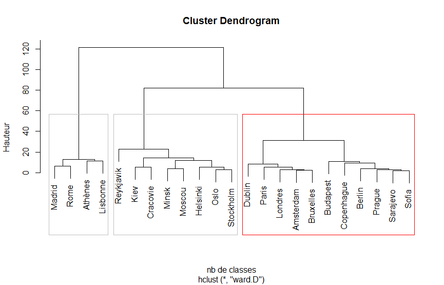

Nous utilisons la Classification Ascendante Hiérarchique (CAH) pour déterminer un nombre de classes pertinent. En observant le dendrogramme ci-dessus, on note une coupure naturelle vers une hauteur d’environ 30. Cela suggère la présence de **3 classes** principales.
Ainsi, nous choisissons de fixer le nombre de classes à 3 pour la suite de l'analyse par k-means.

.png)
.png)

```{cmd}
# Choisir le nombre de classes : 3,4,5 ?
res.class <- kmeans(temperature,centers=3)
class.kmeans <- res.class$cluster
fviz_cluster(res.class, data = temperature, geom = "point")  # Affichage du clustering avec des points
```
result :
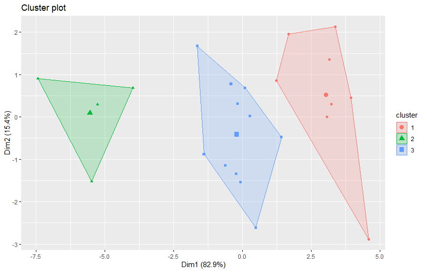

### 1.1.7 Résultats ACP

```{cmd}
res.pca <- PCA(temperature0, scale.unit=TRUE, ind.sup=24:35,quanti.sup=13:16,
               quali.sup=17)
plot.PCA(res.pca, choix="ind", habillage=17)
res.pca$eig
barplot(res.pca$eig[,1])
boxplot(res.pca$ind$coord)
```

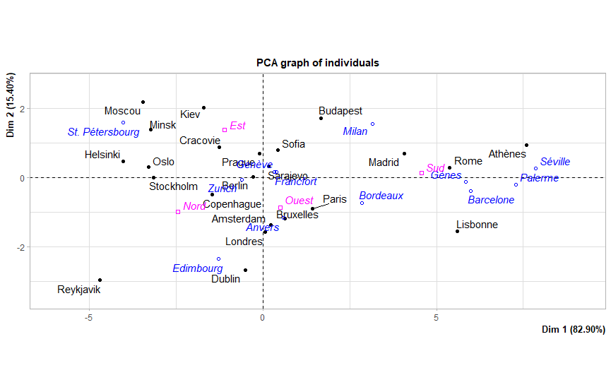
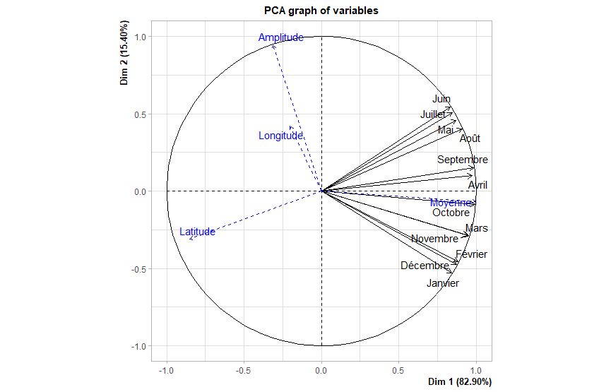
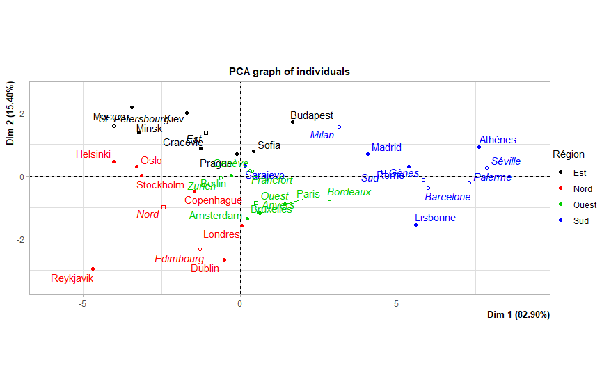
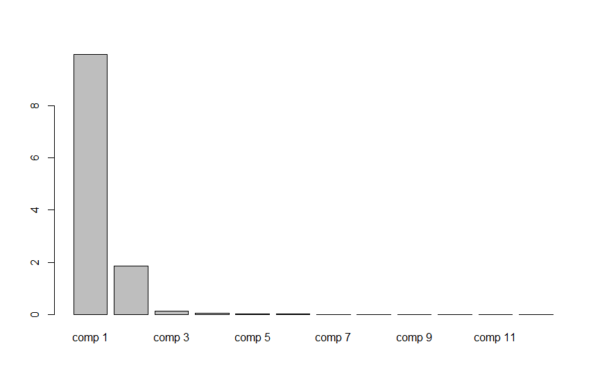
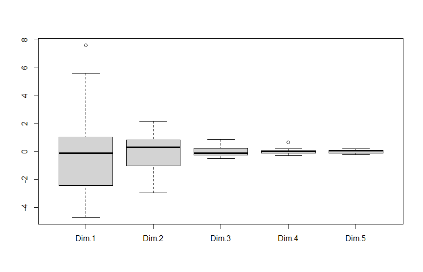

```cmd
          eigenvalue percentage of variance cumulative percentage of variance
comp 1  9.9477504204           82.897920170                          82.89792
comp 2  1.8476485015           15.397070846                          98.29499
comp 3  0.1262558038            1.052131698                          99.34712
comp 4  0.0382934463            0.319112052                          99.66623
comp 5  0.0167094089            0.139245074                          99.80548
comp 6  0.0128330357            0.106941964                          99.91242
comp 7  0.0058302931            0.048585776                          99.96101
comp 8  0.0020318929            0.016932441                          99.97794
comp 9  0.0010234516            0.008528764                          99.98647
comp 10 0.0009527707            0.007939756                          99.99441
comp 11 0.0005367834            0.004473195                          99.99888
comp 12 0.0001341917            0.001118264                         100.00000
```
#### Valeurs propres et variance expliquée

- **CP1** : Explique **82.9%** de la variance, représente surement la différence entre les villes chaudes et froides.
- **CP2** : Explique **15.4%** de la variance, reflète la variation saisonnière des températures.
- Les autres composantes (CP3 à CP12) expliquent ensemble **moins de 1%** de la variance.

#### Interprétation géographique

- **CP1** : Les villes avec **CP1 > 0** sont plus chaudes, celles avec **CP1 < 0** sont plus froides.
- **CP2** : Les villes avec **CP2 > 0** ont une grande variation de température saisonnière, tandis que **CP2 < 0** signifie une température plus constante.

#### Classification des villes

- **Chaud** : CP1 > 0 (Ex : Rome, Madrid)
- **Tempéré** : CP1 environ 0 (Ex : Paris, Bruxelles)
- **Froid** : CP1 < 0 (Ex : Oslo, Stockholm)

#### Graphique des individus

Le graphique des individus montre la projection des différentes capitales le long des deux premières composantes principales. Ce graphique permet de visualiser où chaque capitale se situe dans l'espace de l'ACP. Les couleurs utilisées sur ce graphique correspondent aux différents groupes climatiques identifiés.

#### Biplot

Amplitudes saisonnières : L'amplitude (mesurée par la variation de température au cours de l'année) est fortement orientée vers Dim 2. Cela signifie qu'elle est importante pour expliquer la variance des saisons chaudes et froides.
Longitude et Latitude : Ces variables sont également représentées dans le graphique, mais elles semblent moins corrélées à Dim 1, indiquant que leur influence sur la température n'est pas aussi importante que les mois eux-mêmes.
Mois : Les mois sont alignés selon Dim 1 et Dim 2, ce qui suggère que la température des mois joue un rôle central dans l'analyse thermique. Par exemple, Juin, Juillet, et Août (mois d'été) sont liés à une valeur positive sur Dim 1, tandis que les mois hivernaux comme Décembre et Janvier se dirigent vers Dim 1 négatif, indiquant des températures plus basses.


```{cmd}

res.pca <- PCA(temperature, scale.unit=TRUE, graph=FALSE)
col.hclust <- as.character(factor(class.hclust,levels=1:3,
                                  labels=c("black","red","green")))
plot.PCA(res.pca,col.ind=col.hclust)
# A comparer avec :
#res.hcpc <- HCPC(temperature)
col.kmeans <- as.character(factor(class.kmeans,levels=1:5,
                                  labels=c("black","red","green","blue","purple")))
plot.PCA(res.pca,col.ind=col.kmeans)
```

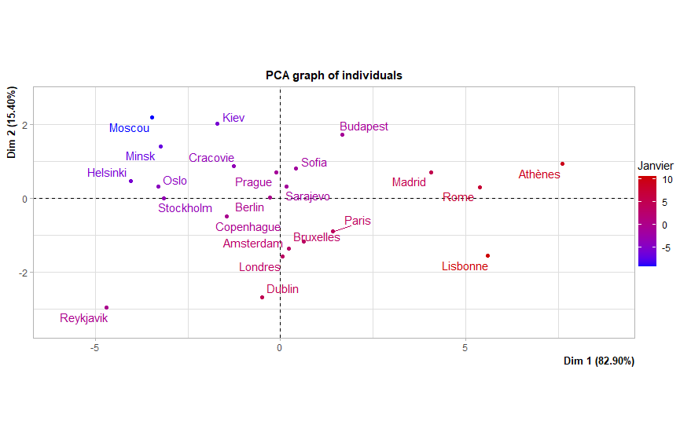
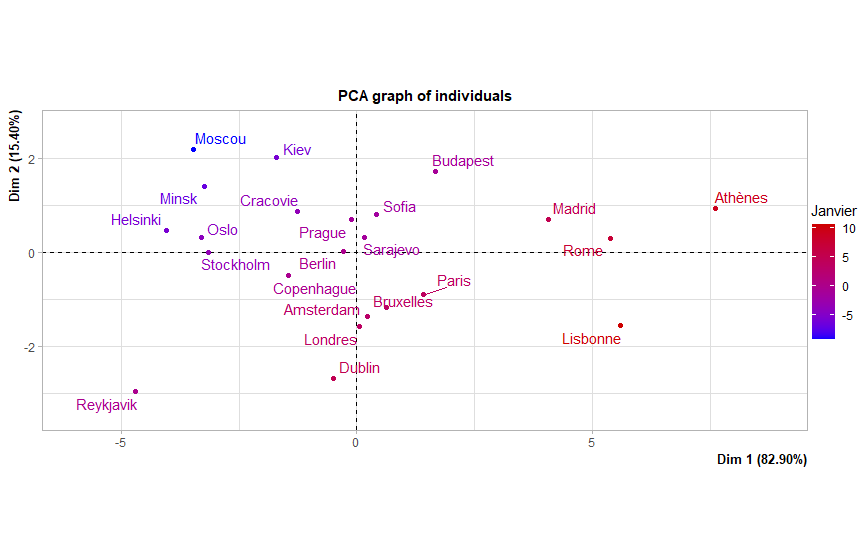
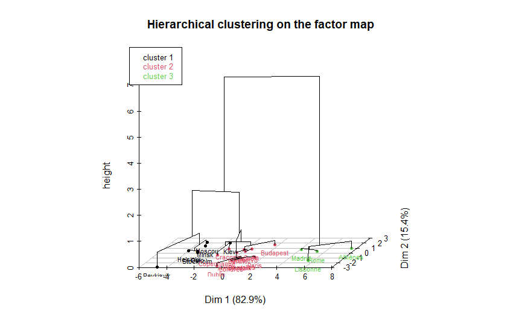

- Clusterisation selon la PCA : Les groupes de villes formés par le clustering hiérarchique semblent se refléter dans la projection PCA, avec une séparation naturelle des clusters.
- Pertinence des variables : Le fait que les villes soient bien séparées selon les deux premières composantes montre que la PCA a bien capturé la variance des données. La variable "Janvier" semble être un facteur important dans la séparation des groupes.
- Interprétation des groupes : Ces groupes peuvent être liés à des similitudes géographiques ou climatiques, comme les températures observées en Janvier.


## 1.2 Classification sur les composantes principales
```{cmd}
# Sans perte d’information #
res.pca <- PCA(temperature0, scale.unit=TRUE, ncp=Inf, ind.sup=24:35,
quanti.sup=13:16, quali.sup=17)
# En ´eliminant le bruit #
# res.pca <- PCA(temperature0, scale.unit=TRUE, ncp=12, ind.sup=24:35,
quanti.sup=13:16, quali.sup=17)
res.hcpc <- HCPC(res.pca)
```

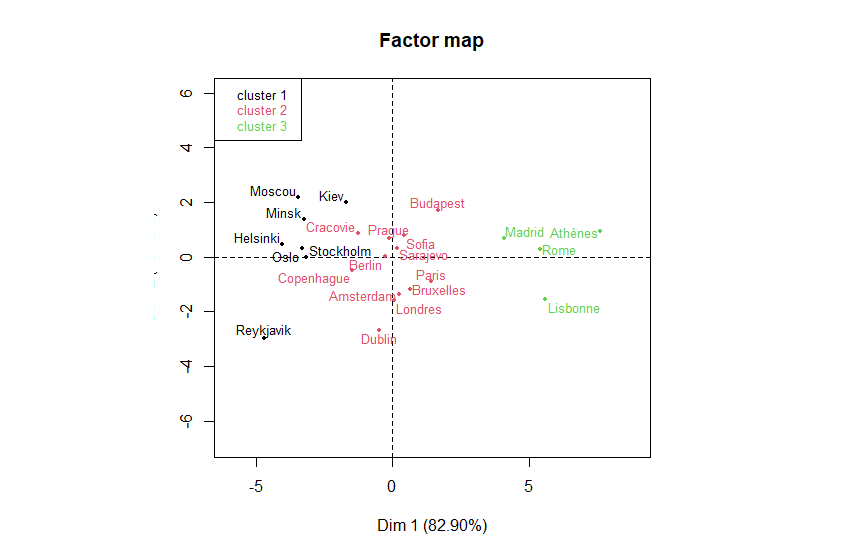

### 1.2.9
Ce graphique montre les résultats d'une PCA suivie d'un clustering hiérarchique (HCPC) sur un ensemble de villes. Il y a trois clusters distincts :
- Cluster 1 (rouge) : Villes situées principalement au centre de l'Europe, comme Paris, Londres.
- Cluster 2 (noir) : Villes du nord, comme Moscou, Helsinki.
- Cluster 3 (vert) : Villes du sud, comme Madrid, Rome, Lisbonne.

### 1.2.10

