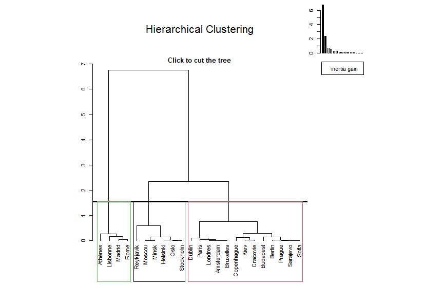
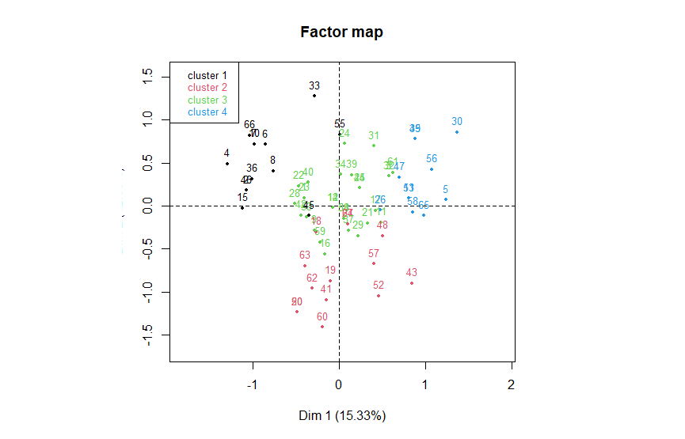
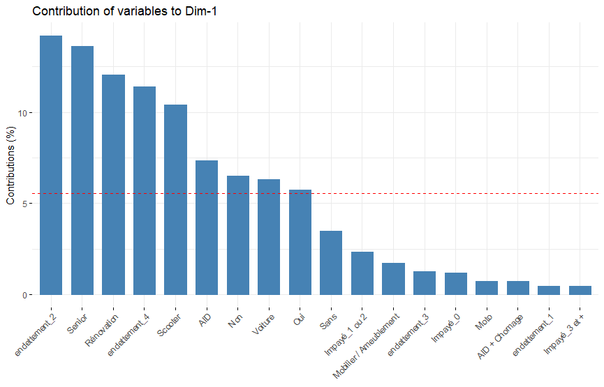
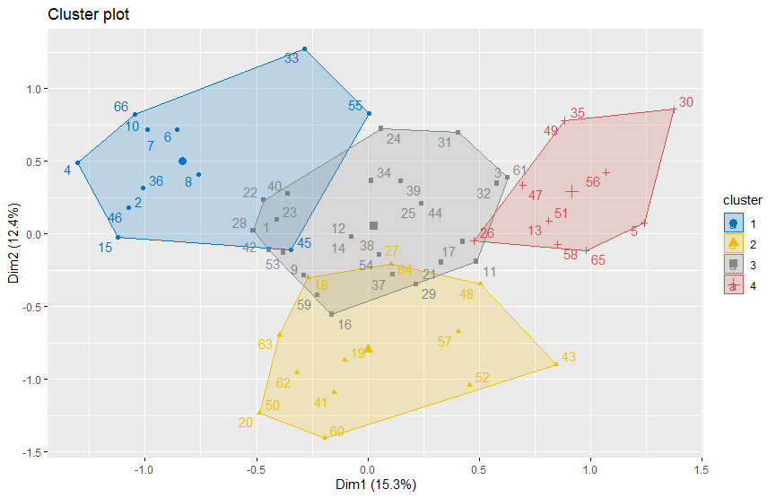
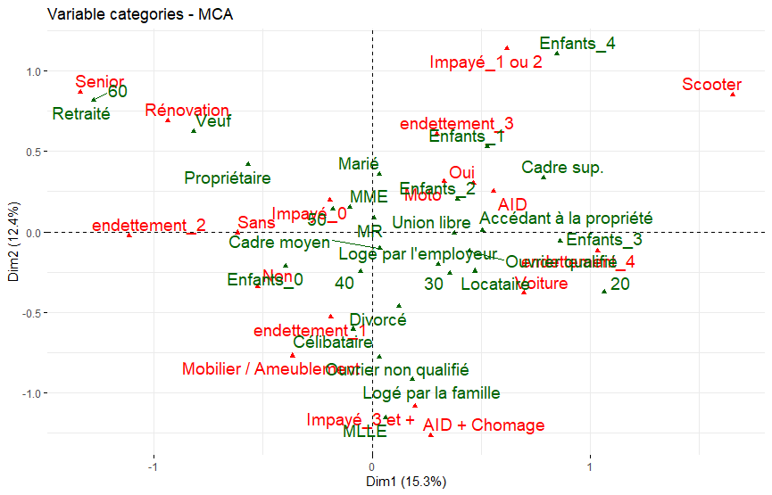
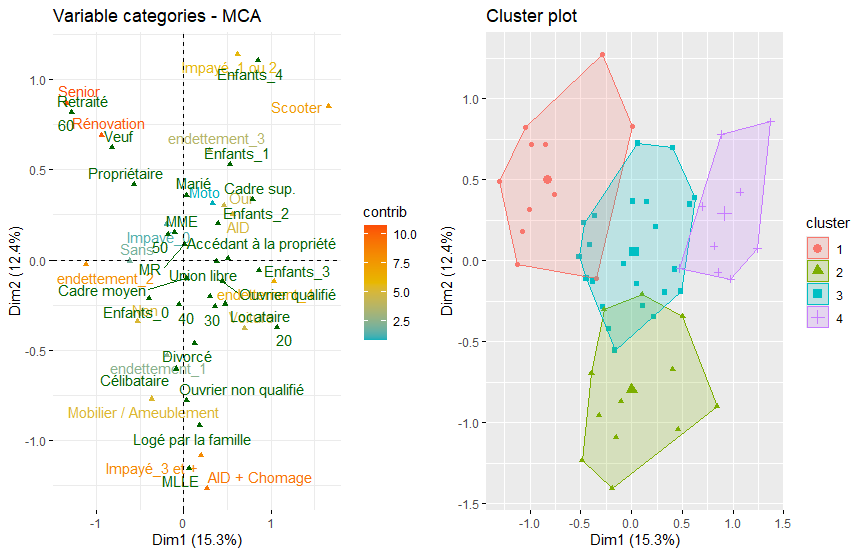

# 1. Données Températures
## 1.1. Classification sur variables quantitatives

```{cmd}
library(FactoMineR)
library(factoextra)
temperature0 <- read.table(file.choose(),header=TRUE, sep=";", dec=".",
row.names=1)
temperature <- temperature0[-(24:35),1:12] # capitales européennes et températures par mois
# Si les variables consid´er´ees ne sont pas homog`enes en variance, il est utile
# de r´eduire (standardiser) les variables avant une classification.
#temperature <- scale(temperature)
# dist : matrice de distance entre les individus
# hclust : algorithme de classification ascendante hi´erarchique
res.hclust <- hclust(dist(temperature),method="ward")
plot(res.hclust,xlab="nb de classes",ylab="Hauteur") # dendrogramme
cl.hclust <- identify(res.hclust)  # version interactive (à éviter ici)
# À la place, on découpe l'arbre hiérarchique en k classes :
nb <- 4 # par exemple
cl.hclust <- cutree(res.hclust, k = nb)

# Affectation des classes
class.hclust <- cl.hclust

for (i in 1:nb) {class.hclust[cl.hclust[[i]]] <- i}
resAUX.class <- kmeans(temperature,centers=10)
resAUX.hclust <- hclust(dist(resAUX.class$centers),method="ward")
plot(resAUX.hclust,xlab="nb de classes",ylab="Hauteur")
```
### 1.1.5/6

Si on relance plusieurs fois le programme de la question 4 on constate que les classes obtenues sont différentes. Cela est dû à l'initialisation aléatoire des centres de gravité des classes.


Nous utilisons la Classification Ascendante Hiérarchique (CAH) pour déterminer un nombre de classes pertinent. En observant le dendrogramme ci-dessus, on note une coupure naturelle vers une hauteur d’environ 30. Cela suggère la présence de **3 classes** principales.
Ainsi, nous choisissons de fixer le nombre de classes à 3 pour la suite de l'analyse par k-means.

.png)
.png)

```{cmd}
# Choisir le nombre de classes : 3,4,5 ?
res.class <- kmeans(temperature,centers=3)
class.kmeans <- res.class$cluster
fviz_cluster(res.class, data = temperature, geom = "point")  # Affichage du clustering avec des points
```
result :


### 1.1.7 Résultats ACP

```{cmd}
res.pca <- PCA(temperature0, scale.unit=TRUE, ind.sup=24:35,quanti.sup=13:16,
               quali.sup=17)
plot.PCA(res.pca, choix="ind", habillage=17)
res.pca$eig
barplot(res.pca$eig[,1])
boxplot(res.pca$ind$coord)
```


```cmd
          eigenvalue percentage of variance cumulative percentage of variance
comp 1  9.9477504204           82.897920170                          82.89792
comp 2  1.8476485015           15.397070846                          98.29499
comp 3  0.1262558038            1.052131698                          99.34712
comp 4  0.0382934463            0.319112052                          99.66623
comp 5  0.0167094089            0.139245074                          99.80548
comp 6  0.0128330357            0.106941964                          99.91242
comp 7  0.0058302931            0.048585776                          99.96101
comp 8  0.0020318929            0.016932441                          99.97794
comp 9  0.0010234516            0.008528764                          99.98647
comp 10 0.0009527707            0.007939756                          99.99441
comp 11 0.0005367834            0.004473195                          99.99888
comp 12 0.0001341917            0.001118264                         100.00000
```
#### Valeurs propres et variance expliquée

- **CP1** : Explique **82.9%** de la variance, représente surement la différence entre les villes chaudes et froides.
- **CP2** : Explique **15.4%** de la variance, reflète la variation saisonnière des températures.
- Les autres composantes (CP3 à CP12) expliquent ensemble **moins de 1%** de la variance.

#### Interprétation géographique

- **CP1** : Les villes avec **CP1 > 0** sont plus chaudes, celles avec **CP1 < 0** sont plus froides.
- **CP2** : Les villes avec **CP2 > 0** ont une grande variation de température saisonnière, tandis que **CP2 < 0** signifie une température plus constante.

#### Classification des villes

- **Chaud** : CP1 > 0 (Ex : Rome, Madrid)
- **Tempéré** : CP1 environ 0 (Ex : Paris, Bruxelles)
- **Froid** : CP1 < 0 (Ex : Oslo, Stockholm)

#### Graphique des individus

Le graphique des individus montre la projection des différentes capitales le long des deux premières composantes principales. Ce graphique permet de visualiser où chaque capitale se situe dans l'espace de l'ACP. Les couleurs utilisées sur ce graphique correspondent aux différents groupes climatiques identifiés.

#### Biplot

Amplitudes saisonnières : L'amplitude (mesurée par la variation de température au cours de l'année) est fortement orientée vers Dim 2. Cela signifie qu'elle est importante pour expliquer la variance des saisons chaudes et froides.
Longitude et Latitude : Ces variables sont également représentées dans le graphique, mais elles semblent moins corrélées à Dim 1, indiquant que leur influence sur la température n'est pas aussi importante que les mois eux-mêmes.
Mois : Les mois sont alignés selon Dim 1 et Dim 2, ce qui suggère que la température des mois joue un rôle central dans l'analyse thermique. Par exemple, Juin, Juillet, et Août (mois d'été) sont liés à une valeur positive sur Dim 1, tandis que les mois hivernaux comme Décembre et Janvier se dirigent vers Dim 1 négatif, indiquant des températures plus basses.


```{cmd}

res.pca <- PCA(temperature, scale.unit=TRUE, graph=FALSE)
col.hclust <- as.character(factor(class.hclust,levels=1:3,
                                  labels=c("black","red","green")))
plot.PCA(res.pca,col.ind=col.hclust)
# A comparer avec :
#res.hcpc <- HCPC(temperature)
col.kmeans <- as.character(factor(class.kmeans,levels=1:5,
                                  labels=c("black","red","green","blue","purple")))
plot.PCA(res.pca,col.ind=col.kmeans)
```


- Clusterisation selon la PCA : Les groupes de villes formés par le clustering hiérarchique semblent se refléter dans la projection PCA, avec une séparation naturelle des clusters.
- Pertinence des variables : Le fait que les villes soient bien séparées selon les deux premières composantes montre que la PCA a bien capturé la variance des données. La variable "Janvier" semble être un facteur important dans la séparation des groupes.
- Interprétation des groupes : Ces groupes peuvent être liés à des similitudes géographiques ou climatiques, comme les températures observées en Janvier.


## 1.2 Classification sur les composantes principales
```{cmd}
# Sans perte d’information #
res.pca <- PCA(temperature0, scale.unit=TRUE, ncp=Inf, ind.sup=24:35,
quanti.sup=13:16, quali.sup=17)
# En ´eliminant le bruit #
# res.pca <- PCA(temperature0, scale.unit=TRUE, ncp=12, ind.sup=24:35,
quanti.sup=13:16, quali.sup=17)
res.hcpc <- HCPC(res.pca)
```


### 1.2.9

```{cmd}
plot.HCPC(res.hcpc, choice = "ind")
```
Ce graphique montre les résultats d'une PCA suivie d'un clustering hiérarchique (HCPC) sur un ensemble de villes. Il y a trois clusters distincts :
- Cluster 1 (rouge) : Villes situées principalement au centre de l'Europe, comme Paris, Londres.
- Cluster 2 (noir) : Villes du nord, comme Moscou, Helsinki.
- Cluster 3 (vert) : Villes du sud, comme Madrid, Rome, Lisbonne.

### 1.2.10 : Analyse du Clustering Hiérarchique
```{cmd}
> res.hcpc$call$t$nb.clust
[1] 3
> res.hcpc$call$t$within
 [1] 12.000000000  5.237349047  2.881145878  2.119286630  1.523668752  1.232214708  0.959979191  0.798661153  0.643435441
[10]  0.492720128  0.370631136  0.255438457  0.201557505  0.152512154  0.118340088  0.086935386  0.064962439  0.047549074
[19]  0.035692437  0.024106815  0.013934889  0.006904631
> res.hcpc$call$t$inert.gain
 [1] 6.762650953 2.356203170 0.761859247 0.595617878 0.291454044 0.272235517 0.161318038 0.155225712 0.150715314
[10] 0.122088991 0.115192679 0.053880952 0.049045351 0.034172066 0.031404701 0.021972947 0.017413366 0.011856636
[19] 0.011585622 0.010171927 0.007030258 0.006904631
> res.hcpc$call$t$quot
[1] 0.5501153 0.7355707 0.7189536 0.8087156 0.7790681 0.8319567 0.8056426 0.7657647
```
- **Nombre Optimal de Classes** : Le clustering a identifié **3 clusters** comme optimal pour résumer les données, ce qui indique une structuration claire en trois groupes principaux.

- **Inertie Intra-Classe** : L'inertie intra-classe, qui mesure la cohérence interne des clusters, diminue significativement avec l'augmentation du nombre de clusters, suggérant que les points au sein de chaque cluster sont relativement proches les uns des autres.

- **Gain d'Inertie Inter-Classe** : Le gain d'inertie montre des améliorations de l'homogénéité lors de la formation des trois premiers clusters, après quoi les gains deviennent marginaux, indiquant peu de bénéfice à ajouter plus de clusters.

- **Rapport des Inerties Intra-Classe Successives** : Ce ratio indique une décroissance de l'amélioration en homogénéité au fur et à mesure que le nombre de clusters augmente, justifiant la sélection de trois clusters comme étant la plus équilibrée.

Ces résultats suggèrent que trois clusters fournissent une segmentation efficace et significative des données, ce qui peut être visualisé et interprété plus avant en fonction de critères spécifiques à l'ensemble de données utilisé.

## 1.2.11 :
```{cmd}
res.hcpc <- HCPC(res.pca,t.levels="all")
```


## 1.2.12 :
```{cmd}
res.hcpc$desc.var

Link between the cluster variable and the categorical variables (chi-square test)
=================================================================================
           p.value df
Région 0.001195843  6

Description of each cluster by the categories
=============================================
$`1`
NULL

$`2`
NULL

$`3`
           Cla/Mod Mod/Cla   Global      p.value   v.test
Région=Sud      80     100 21.73913 0.0005646527 3.448048


Link between the cluster variable and the quantitative variables
================================================================
               Eta2      P-value
Moyenne   0.9177156 1.422898e-11
Octobre   0.8989724 1.107640e-10
Mars      0.8864732 3.556182e-10
Novembre  0.8707485 1.301232e-09
Septembre 0.8559706 3.841596e-09
Avril     0.8353281 1.466202e-08
Février   0.8246130 2.754070e-08
Décembre  0.7730136 3.630759e-07
Janvier   0.7476664 1.046528e-06
Août      0.7159888 3.414722e-06
Latitude  0.6346271 4.239970e-05
Juillet   0.6309204 4.690301e-05
Mai       0.5860137 1.478632e-04
Juin      0.5752594 1.910900e-04

Description of each cluster by quantitative variables
=====================================================
$`1`
             v.test Mean in category Overall mean sd in category Overall sd      p.value
Latitude   2.776774        56.128571   49.8826087      5.8502050   6.978455 0.0054901372
Amplitude  2.142021        21.985714   18.8000000      4.8430889   4.614062 0.0321917637
Juillet   -1.994799        16.785714   18.9260870      2.4549824   3.328822 0.0460648072
Juin      -2.058250        14.728571   16.7652174      2.5172061   3.069855 0.0395661536
Août      -2.479950        15.485714   18.3043478      2.2585890   3.526111 0.0131400659
Mai       -2.549115        10.842857   13.2739130      2.4289075   2.958733 0.0107996531
Septembre -3.137128        10.985714   14.7086957      1.6685568   3.681790 0.0017061164
Janvier   -3.255703        -5.142857    0.1739130      2.6250753   5.066447 0.0011311207
Décembre  -3.269173        -2.914286    1.8434783      1.8302448   4.515079 0.0010786223
Novembre  -3.359278         0.600000    5.0782609      0.9396048   4.135841 0.0007814643
Moyenne   -3.373602         5.500000    9.3739130      0.7671841   3.562512 0.0007419150
Avril     -3.387118         4.671429    8.3782609      1.5489298   3.395260 0.0007063103
Février   -3.442119        -4.600000    0.9565217      2.3366643   5.008152 0.0005771764
Octobre   -3.453788         5.757143   10.0652174      0.9194053   3.869795 0.0005527723
Mars      -3.675091        -1.142857    4.0608696      1.1043513   4.392854 0.0002377646

$`2`
NULL

$`3`
             v.test Mean in category Overall mean sd in category Overall sd      p.value
Moyenne    3.851788           15.750    9.3739130       1.393736   3.562512 0.0001172584
Septembre  3.808964           21.225   14.7086957       1.536839   3.681790 0.0001395501
Octobre    3.717610           16.750   10.0652174       1.911151   3.869795 0.0002011160
Août       3.705134           24.375   18.3043478       1.883315   3.526111 0.0002112792
Novembre   3.692832           12.175    5.0782609       2.264260   4.135841 0.0002217705
Juillet    3.603579           24.500   18.9260870       2.089258   3.328822 0.0003138648
Avril      3.531688           13.950    8.3782609       1.175798   3.395260 0.0004129164
Mars       3.448552           11.100    4.0608696       1.274755   4.392854 0.0005636006
Février    3.434969            8.950    0.9565217       1.744276   5.008152 0.0005926217
Juin       3.389407           21.600   16.7652174       1.864135   3.069855 0.0007004406
Décembre   3.387321            8.950    1.8434783       2.337199   4.515079 0.0007057887
Janvier    3.292484            7.925    0.1739130       2.076505   5.066447 0.0009930662
Mai        3.183059           17.650   13.2739130       1.553222   2.958733 0.0014572796
Latitude  -3.225059           39.425   49.8826087       1.523770   6.978455 0.0012594670
```

précision : je ne pense pas qu'il soit normal que $1 et $2 soient NULL, mais je ne sais pas comment les remplir aprés avoir tenté plusieurs choses.
### Relation entre les Variables Catégoriques et les Clusters
- **Chi-square Test sur 'Région'** : Une association significative (p = 0.0012) suggère une répartition inégale des régions entre les clusters.

### Description des Clusters par Catégories
- **Cluster 3** : Forte présence de la 'Région=Sud' avec 80% de ses observations dans ce cluster, indiquant une corrélation notable (p = 0.00056, v-test = 3.448).

### Relation entre les Variables Quantitatives et les Clusters
- **Variables Clés** : 'Moyenne', 'Octobre', et 'Mars' montrent de grandes variations inter-cluster, soulignées par des p-values très faibles, signifiant leur rôle crucial dans la distinction des clusters.

### Description des Clusters par Variables Quantitatives
- **Cluster 1** : Des valeurs nettement inférieures à la moyenne pour plusieurs mois indiquent des conditions possiblement plus froides.
- **Cluster 3** : Montre des valeurs supérieures pour la plupart des mois, reflétant probablement des conditions plus chaudes, typiques de 'Région=Sud'.

### Interprétation
Les clusters reflètent des distinctions géographiques et saisonnières marquées, avec les clusters 1 et 3 représentant des extrêmes météorologiques. Les données du cluster 2 manquent de distinction notable, suggérant un manque de caractéristiques uniques ou un problème de données.

## 1.2.13 : individus les plus proches de leur centre de gravitée

```{cmd}
> res.hcpc$desc.axe

Link between the cluster variable and the quantitative variables
================================================================
           Eta2      P-value
Dim.1 0.9086821 4.032342e-11
Dim.3 0.2691961 4.345188e-02

Description of each cluster by quantitative variables
=====================================================
$`1`
         v.test Mean in category Overall mean sd in category Overall sd      p.value
Dim.1 -3.317358        -3.372519 1.867468e-16      0.8494564   3.154005 0.0009087321

$`2`
         v.test Mean in category  Overall mean sd in category Overall sd    p.value
Dim.3 -2.414108       -0.1750962 -2.531188e-16      0.2178523  0.3553249 0.01577378

$`3`
        v.test Mean in category Overall mean sd in category Overall sd      p.value
Dim.1 3.863084         5.661507 1.867468e-16       1.264335   3.154005 0.0001119644

> res.hcpc$spec
NULL
```

- Cluster 1 sur Dim.1 : La valeur moyenne de -3.372519 avec un v-test de -3.317358 indique que ce cluster est situé loin dans la direction négative sur Dim.1 par rapport à la moyenne globale. Ceci suggère que les individus les plus proches du centroïde de ce cluster auront probablement des valeurs de Dim.1 proches de -3.372519.

- Cluster 2 sur Dim.3 : La valeur moyenne faiblement négative de -0.1750962 montre que ce cluster est relativement proche de la moyenne globale sur Dim.3. Les individus les plus éloignés du centroïde d'un autre cluster seront ceux qui sont significativement plus éloignés en valeur absolue sur cette dimension par rapport aux autres clusters.

- Cluster 3 sur Dim.1 : Avec une valeur moyenne de 5.661507, ce cluster est situé loin dans la direction positive sur Dim.1. Les individus les plus proches du centroïde de ce cluster auront des valeurs de Dim.1 proches de 5.661507.

Encore une fois, la commande `res.hcpc$spec` ne renvoie rien, ce qui est étrange. Il est possible que cela soit dû à un problème de données ou à une spécificité de la fonction utilisée. Cela m'empêche de fournir une analyse plus approfondie sur les individus les plus proches de leur centre de gravité...

# 2 Données Bancaires
## 2.1 Classification sur score d'une AFCM
```{cmd}
credit0 <- read.csv("credit.csv",header=TRUE,sep=";",row.names=1)
credit=credit0[-68,c(1,2,3,10,11,4,5,6,7,8,9)]
for (i in 1:ncol(credit)) credit[,i] <- factor(as.character(credit[,i]))
res.MCA=MCA(credit[-67,],quali.sup=6:11,graph=FALSE)
HCPC(res.MCA)
# Visualisation des valeurs propres (eigenvalues) pour évaluer l'importance des axes
eigenvalues <- get_eigenvalue(res.MCA)
barplot
# Affichage des contributions des variables aux axes
fviz_contrib(res.MCA, choice = "var", axes = 1)
fviz_contrib(res.MCA, choice = "var", axes = 2)
```







### Analyse des Variables (Premier Graphique)
Le premier graphique montre la contribution et la position des différentes catégories de variables sur les axes Dim1 et Dim2 :

- **Axe Dim1** (15.33% de la variance expliquée) :
  - Les catégories telles que "endettement_3", "Enfants_1", et "Cadre sup." sont situées vers la droite, suggérant une association avec des caractéristiques de clients potentiellement plus stables ou avec un certain niveau de revenu (cadres supérieurs).
  -  A gauche, des catégories comme "Impayé_0", "Sans", "Cadre moyen" indiquent une possible caractérisation de clients ayant moins de charges ou d'endettement, ou un niveau de revenu inférieur.

- **Axe Dim2** (12.24% de la variance expliquée) :
  - En haut, "Senior", "Retraité", et "Veuve" pourraient indiquer un groupe d'âge plus élevé et des situations personnelles spécifiques.
  - En bas, des variables comme "Mobilier / Ameublement", "Impayé_3 et +" montrent des tendances associées peut-être à des jeunes adultes ou à des individus avec des problèmes de paiement.

### Analyse des Clusters (Deuxième Graphique)
Les graphiques montrent quatre clusters relativement délimités :

- **Cluster 1 (Bleu)** : Les individus de ce cluster se trouvent majoritairement sur la gauche du premier axe, ce qui pourrait indiquer des clients avec moins de charges financières ou un statut socio-économique inférieur.

- **Cluster 2 (Jaune)** : Situé principalement en bas du graphique, ce groupe pourrait rassembler des individus plus jeunes ou ceux ayant des difficultés financières (comme suggéré par la proximité de "Impayé_3 et +").

- **Cluster 3 (Vert)** : Placé au centre mais tendant vers la droite du premier axe, ce cluster peut représenter des individus avec un statut socio-économique moyen à élevé.

- **Cluster 4 (Rouge)** : Localisé en haut à droite, ce groupe inclut probablement des personnes âgées, retraitées, indiquant un niveau de vie stable ou des besoins spécifiques en matière de produits financiers.

Il est important de souligner que l'information n'est pas assez importante avec seulement 2 axes (seulement 27% de la variance expliquée). Il serait intéressant d'explorer plus d'axes pour une meilleure compréhension des données. De plus, la séparation des clusters n'est pas très marquée, ce qui pourrait indiquer que les variables utilisées ne sont pas suffisamment discriminantes pour une classification claire.
